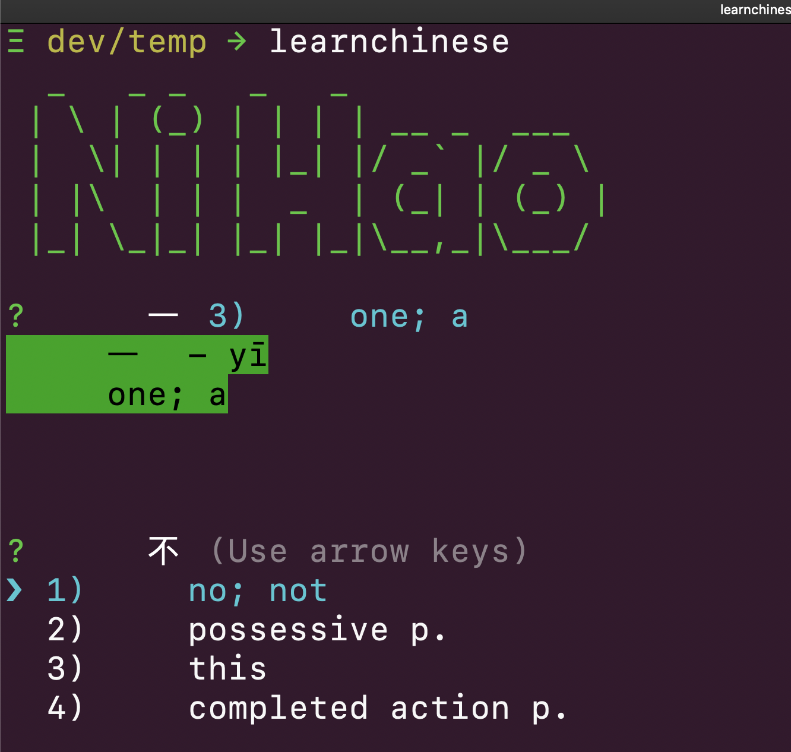

# learn chinese in terminal
learn chinese character in your terminal

$npm install -g learnchinese
$learnchinese

the default mode is mixed, 5 questions then 5 character flashcard loop
$learnchinese --mixed 

will keep runnning the flashcard loop,
$learnchinese --learn 

quiz mode, 
$learnchinese --quiz
#FYI there is a local JSON file which holds your learning and quiz score
you can reset it by 
$learnchinese --reset

# Help
$learnchinese --help

